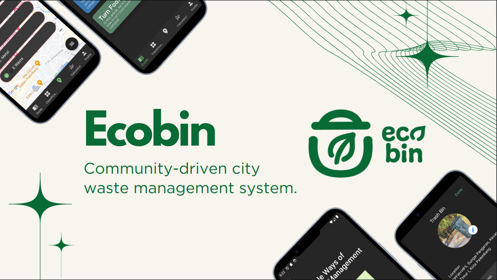
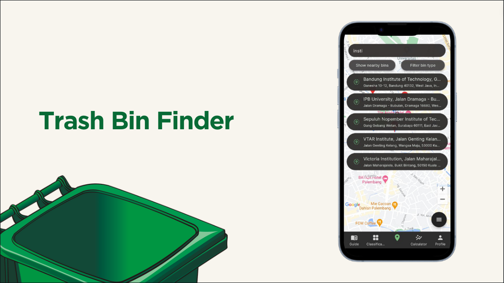
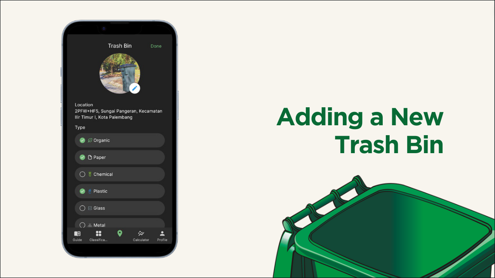
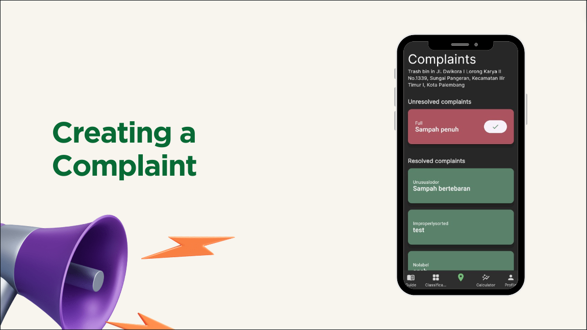
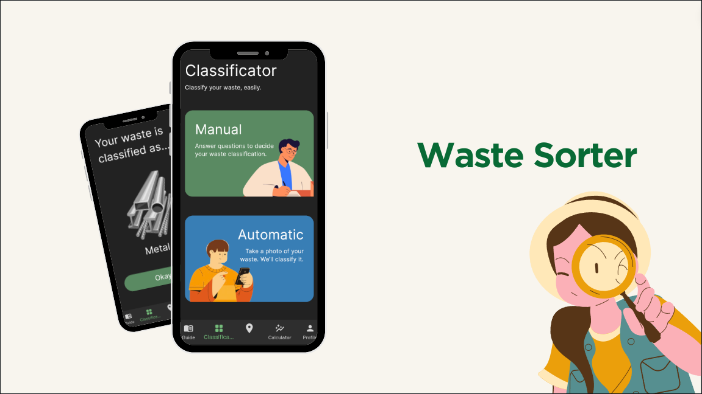
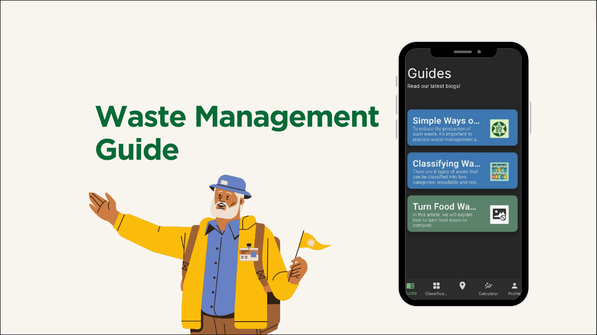
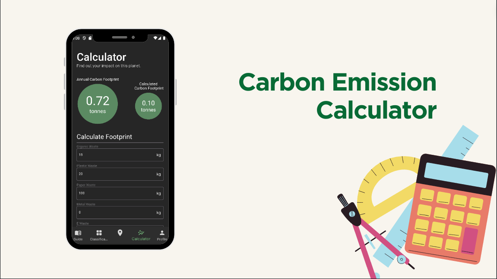

# 🍀 EcoBin

EcoBin is an Android Application that aims to provide a platform for a community-driven city waste management system.

[Download Latest Version](https://github.com/competeteam/EcoBin/releases/latest)

## ⚡ Main Features

## 🕹️ Tech Stacks

* Dart
* Flutter
* Google Firebase

## 🦺 Minimum Requirements

> This section is only necessary to recompile the code from scratch (WARNING: This action is strongly discouraged since
> it is not tested on a containerized platform. Do not do this unless you know what you're doing.)

* Flutter 3.12 and up
* Dart 3.2 and up

## 🤖 How to Run Locally

0. Make sure that all the requirements are installed and Firebase has been set up
1. Clone this repository
2. run `flutter pub get` to get all the required dependencies
3. Create a new `.env` file in the root folder with the same content as the `.env.example` file (fill in the empty
   fields)
4. Run the app using `flutter run`, ensure you already have a working Android emulator

## 💻 Developers

| Name                                              | Features                                                                         |
|---------------------------------------------------|----------------------------------------------------------------------------------|
| [Wilson Tansil](https://github.com/Tansil011019)  | Onboarding Page; Manual / Automatic AI-Based classification                      |
| [Farizki Kurniawan](https://github.com/farizkik)  | Google Maps API Integrator; Finding and Creating Trash Bins; Creating Complaints |
| [Frankie Huang](https://github.com/frankiehuangg) | Profile Page; Firebase Authenticator, Firebase Firestore, Firebase Storage       |
| [Michael Utama](https://github.com/Michaelu670)   | Waste Management Guide; Carbon Emission Calculator                               |

Feel free to contact the developers above if you have any questions regarding this project.
